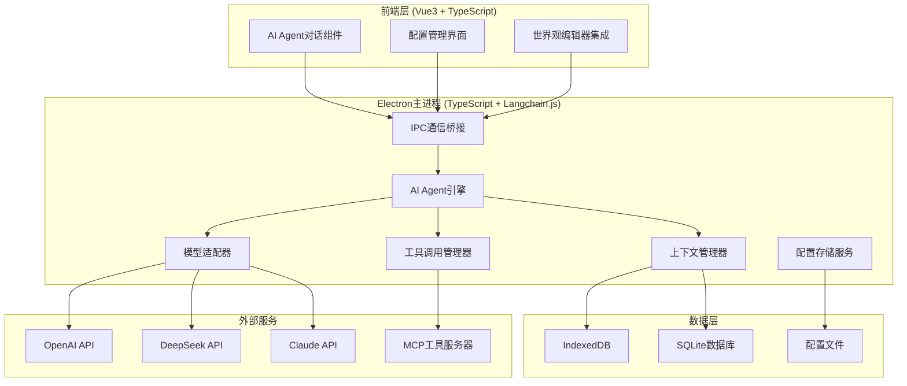

# AI Agent集成功能设计文档

## 概述

本设计文档详细描述了为"世界观构建器"添加基于Langchain4j的AI Agent功能的技术实现方案。该功能旨在通过智能分析人物、文本、地图关系，为创作者提供智能创作辅助，解决创作过程中的偏离和记忆问题。

### 设计目标
- 集成基于Langchain4j的AI Agent引擎
- 提供直观的AI对话界面
- 支持多种AI模型配置（OpenAI、DeepSeek、Claude等）
- 实现MCP工具调用能力
- 提供世界观数据的智能分析
- 确保对话上下文的连续性

## 架构设计

### 整体架构



### 技术栈选择

#### 前端技术栈
- **Vue 3 + TypeScript**: 现有技术栈，保持一致性
- **Pinia**: 状态管理，用于AI Agent状态
- **WebSocket/IPC**: 与后端服务通信

#### 后端技术栈
- **Langchain.js**: AI Agent核心引擎，TypeScript实现
- **Node.js**: Electron主进程运行环境
- **MCP TypeScript SDK**: 工具调用协议实现 <mcreference link="https://modelcontextprotocol.io/introduction" index="1">1</mcreference>
- **SQLite**: 本地数据存储
- **better-sqlite3**: Node.js SQLite驱动

## 组件和接口设计

### 1. 前端组件

#### AIAgentChat.vue
```typescript
interface AIAgentChatProps {
  worldId: string
  initialContext?: string
}

interface ChatMessage {
  id: string
  role: 'user' | 'assistant' | 'system'
  content: string
  timestamp: Date
  metadata?: {
    toolCalls?: ToolCall[]
    worldAnalysis?: WorldAnalysisResult
  }
}

interface ToolCall {
  id: string
  name: string
  parameters: Record<string, any>
  result?: any
}
```

#### AIAgentConfig.vue
```typescript
interface AIModelConfig {
  provider: 'openai' | 'deepseek' | 'claude' | 'local'
  apiKey?: string
  baseUrl?: string
  model: string
  temperature: number
  maxTokens: number
  systemPrompt?: string
}

interface AgentConfig {
  modelConfig: AIModelConfig
  enabledTools: string[]
  contextWindow: number
  memoryStrategy: 'sliding' | 'summary' | 'vector'
}
```

### 2. Electron主进程服务

#### AIAgentEngine
```typescript
import { ChatOpenAI } from "@langchain/openai"
import { ChatAnthropic } from "@langchain/anthropic"
import { AgentExecutor, createOpenAIFunctionsAgent } from "langchain/agents"
import { pull } from "langchain/hub"

class AIAgentEngine {
  private agent: AgentExecutor | null = null
  private model: ChatOpenAI | ChatAnthropic | null = null
  private tools: Tool[] = []
  
  async initialize(config: AgentConfig): Promise<void>
  async sendMessage(message: string, context?: any): Promise<string>
  async addTool(tool: Tool): Promise<void>
  async updateConfig(config: Partial<AgentConfig>): Promise<void>
  async getConversationHistory(): Promise<ChatMessage[]>
}
```

### 3. TypeScript工具实现

#### 世界观分析工具
```typescript
import { Tool } from "@langchain/core/tools"
import { z } from "zod"

class WorldDataAnalysisTool extends Tool {
  name = "analyze_world_data"
  description = "分析世界观数据，包括人物关系、地理信息、时间线等"
  
  schema = z.object({
    worldId: z.string().describe("世界观ID"),
    analysisType: z.enum(["character", "location", "timeline", "relationship"]).describe("分析类型")
  })
  
  async _call(input: z.infer<typeof this.schema>): Promise<string> {
    const { worldId, analysisType } = input
    // 从IndexedDB获取世界观数据
    const worldData = await this.getWorldData(worldId)
    
    switch (analysisType) {
      case "character":
        return this.analyzeCharacters(worldData)
      case "location":
        return this.analyzeLocations(worldData)
      case "timeline":
        return this.analyzeTimeline(worldData)
      case "relationship":
        return this.analyzeRelationships(worldData)
    }
  }
  
  private async getWorldData(worldId: string): Promise<UnifiedWorldData> {
    // 实现数据获取逻辑
  }
}
```

#### MCP工具集成
```typescript
import { McpClient } from "@modelcontextprotocol/sdk/client/index.js"
import { StdioClientTransport } from "@modelcontextprotocol/sdk/client/stdio.js"

class MCPToolManager {
  private clients: Map<string, McpClient> = new Map()
  
  async registerMCPServer(name: string, command: string, args: string[]): Promise<void> {
    const transport = new StdioClientTransport({
      command,
      args
    })
    
    const client = new McpClient({
      name: `world-builder-${name}`,
      version: "1.0.0"
    }, {
      capabilities: {
        tools: {}
      }
    })
    
    await client.connect(transport)
    this.clients.set(name, client)
  }
  
  async callMCPTool(serverName: string, toolName: string, parameters: any): Promise<any> {
    const client = this.clients.get(serverName)
    if (!client) {
      throw new Error(`MCP server ${serverName} not found`)
    }
    
    return await client.callTool({
      name: toolName,
      arguments: parameters
    })
  }
}
```

## 数据模型

### AI Agent会话数据
```typescript
interface AgentSession {
  id: string
  worldId: string
  title: string
  messages: ChatMessage[]
  context: SessionContext
  createdAt: Date
  updatedAt: Date
}

interface SessionContext {
  worldSnapshot: WorldDataSnapshot
  activeCharacters: string[]
  activeLocations: string[]
  conversationSummary: string
  toolCallHistory: ToolCall[]
}
```

### 世界观分析结果
```typescript
interface WorldAnalysisResult {
  analysisType: 'character' | 'location' | 'timeline' | 'relationship'
  insights: Insight[]
  suggestions: Suggestion[]
  inconsistencies: Inconsistency[]
  confidence: number
}

interface Insight {
  id: string
  type: string
  description: string
  relevantEntities: string[]
  importance: 'high' | 'medium' | 'low'
}
```

## 错误处理

### 错误类型定义
```typescript
enum AIAgentErrorType {
  SERVICE_UNAVAILABLE = 'SERVICE_UNAVAILABLE',
  MODEL_API_ERROR = 'MODEL_API_ERROR',
  TOOL_EXECUTION_ERROR = 'TOOL_EXECUTION_ERROR',
  CONTEXT_OVERFLOW = 'CONTEXT_OVERFLOW',
  CONFIGURATION_ERROR = 'CONFIGURATION_ERROR'
}

interface AIAgentError {
  type: AIAgentErrorType
  message: string
  details?: any
  timestamp: Date
  recoverable: boolean
}
```

### 错误处理策略
1. **服务不可用**: 自动重试机制，降级到离线模式
2. **API错误**: 模型切换，错误提示
3. **工具执行错误**: 跳过工具调用，继续对话
4. **上下文溢出**: 自动摘要，保留关键信息
5. **配置错误**: 用户友好的配置向导

## 测试策略

### 单元测试
- **前端组件测试**: Vue Test Utils + Vitest
- **Java服务测试**: JUnit 5 + Mockito
- **工具调用测试**: MCP工具模拟

### 集成测试
- **端到端对话测试**: 模拟完整对话流程
- **多模型兼容性测试**: 测试不同AI模型的集成
- **数据一致性测试**: 验证世界观数据分析准确性

### 性能测试
- **响应时间测试**: 对话响应时间 < 3秒
- **并发测试**: 支持多个会话同时进行
- **内存使用测试**: 长时间对话的内存管理

## 实现计划

### 阶段1: 基础架构搭建（2周）
1. 安装Langchain.js和相关依赖
2. 在Electron主进程中集成AI Agent引擎
3. 实现渲染进程与主进程的IPC通信
4. 创建基础的AI对话组件

### 阶段2: 核心功能实现（3周）
1. 实现AI模型配置和切换
2. 开发世界观数据分析工具
3. 集成MCP工具调用能力
4. 实现对话上下文管理

### 阶段3: 高级功能和优化（2周）
1. 实现智能创作辅助功能
2. 添加一致性检查工具
3. 优化性能和用户体验
4. 完善错误处理和恢复机制

### 阶段4: 测试和部署（1周）
1. 完整的功能测试
2. 性能优化
3. 文档编写
4. 部署和发布准备

## 安全考虑

### 数据安全
- **API密钥加密存储**: 使用Electron的safeStorage API
- **本地数据加密**: 敏感世界观数据的加密存储
- **网络通信安全**: HTTPS/WSS加密通信

### 隐私保护
- **数据最小化**: 只发送必要的上下文数据
- **本地优先**: 优先使用本地模型和工具
- **用户控制**: 用户可控制数据共享范围

## 扩展性设计

### 插件架构
- **工具插件**: 支持自定义MCP工具
- **模型插件**: 支持新的AI模型集成
- **分析插件**: 支持自定义世界观分析逻辑

### API设计
```typescript
interface AIAgentAPI {
  // 对话接口
  sendMessage(message: string, context?: any): Promise<string>
  
  // 工具接口
  registerTool(tool: CustomTool): void
  callTool(name: string, params: any): Promise<any>
  
  // 配置接口
  updateConfig(config: Partial<AgentConfig>): Promise<void>
  getConfig(): Promise<AgentConfig>
}
```

---

本设计文档提供了AI Agent集成功能的完整技术方案，确保了系统的可扩展性、可维护性和用户体验。通过采用成熟的技术栈和标准化的协议，该方案能够有效地集成到现有的世界观构建器中，为用户提供强大的AI辅助创作能力。