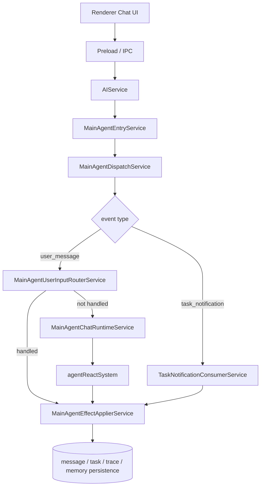
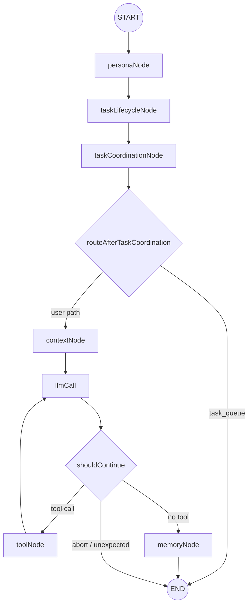
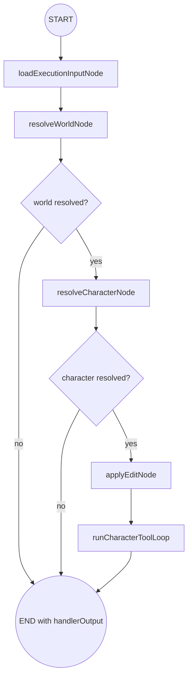
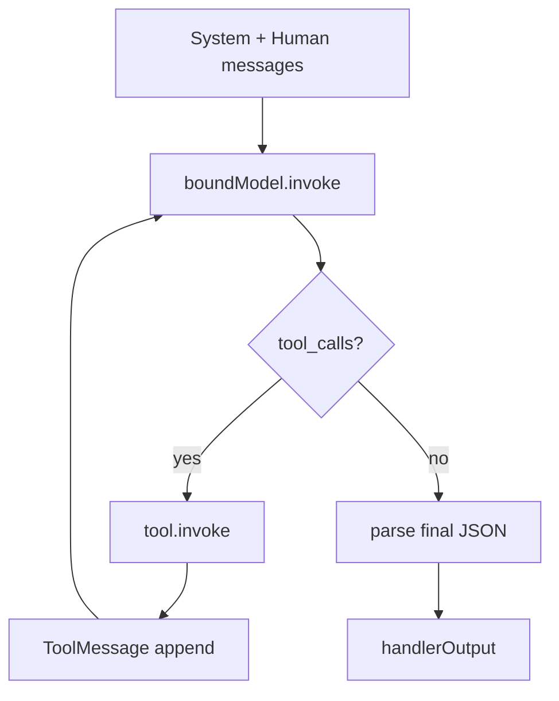
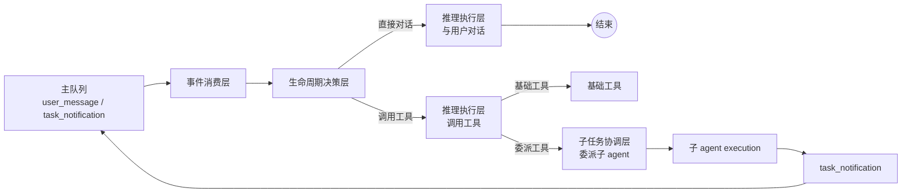

# AI Agent 架构说明

> 状态说明（2026-03-27）
>
> 本文件描述当前项目的有效架构定义、当前真实运行逻辑、理想控制面目标，以及仍需继续完成的任务列表。
> 不再保留旧版评审过程、阶段性收口记录或迭代叙事。

## 目标

当前项目的目标是构建一个：

`单主会话`
`主 agent 控制`
`可委派子 agent`
`后台执行长任务`

的 AI 助手系统。

核心原则只有三条：

1. 用户只和主 agent 通信
2. 子 agent 只和主 agent 通信，不直接面向用户
3. 主 agent 是唯一能创建、续跑、关闭子 agent 生命周期的控制器

---

## 主链

当前有效主链如下：

`renderer(Chat UI)`
`-> preload / IPC`
`-> AIService`
`-> MainAgentEntryService`
`-> MainAgentDispatchService`
`-> 按事件类型分流`
`   - user_message -> user input router / chat runtime`
`   - task_notification -> task notification consumer`
`-> effect applier`
`-> message / task / trace / memory 等持久化`

这条主链代表以下事实：

1. 用户消息和子 agent 通知共享同一个 dispatch 入口
2. 主 agent 一次只处理一条输入
3. task notification 不再走普通聊天主图主路径

---

## 分层

### 1. 前端聊天层

负责：

- 展示消息
- 接收流式输出
- 展示 graphlog
- 展示 task trace / dispatch 状态
- 展示子 agent execution 的输入 / 输出 inspection

### 2. Electron 接入层

负责：

- IPC 边界
- 暴露聊天、任务、memory、worldbuilding 接口

### 3. 主 agent 入口与分发层

负责：

- 接收 `user_message`
- 接收 `task_notification`
- 统一排队
- 串行消费
- 按来源分流到对应处理器

当前关键对象：

- `MainAgentEntryService`
- `MainAgentDispatchService`
- `processMainAgentEvent`

### 4. 主 agent 聊天运行层

负责：

- 驱动 LangGraph 主图
- 输出流式回复
- 将运行结果转成 effect

当前关键对象：

- `MainAgentChatRuntimeService`
- `agentReactSystem`
- `MainAgentEffectApplierService`

### 5. 任务与后台编排层

负责：

- task 状态管理
- execution 管理
- 子 agent 执行调度
- notification 写入与消费
- trace
- execution inspection snapshot 归一化
- 启动恢复

当前关键对象：

- `taskService`
- `taskExecutionService`
- `taskNotificationService`
- `subAgentDispatcherService`
- `taskTraceService`
- `taskRecoveryService`

### 6. agent graph 层

负责：

- persona policy
- task lifecycle 判断
- task queue 决策
- context 构建
- 模型调用
- 工具调用
- memory 写入

当前主图节点：

- `personaNode`
- `taskLifecycleNode`
- `taskCoordinationNode`
- `contextNode`
- `llmCall`
- `toolNode`
- `memoryNode`

### 7. 记忆与人格层

当前仍与主 agent 绑定。

后续子 agent 可以拥有自己的记忆模块，但当前阶段不将记忆层作为主优先级重构对象。

---

## 通信边界

## 1. 用户 -> 主 agent

用户只发送自然语言。

用户输入在系统内部只应被主 agent 解释为以下几类语义：

- 普通聊天
- 创建子任务
- 为当前任务补充参数
- 确认关闭任务
- 取消任务

用户不应直接感知以下内部对象：

- execution
- notification
- pendingContext
- dispatcher
- 子 agent payload schema

## 2. 主 agent -> 子 agent

主 agent 不应以自由对话方式驱动子 agent，而应通过结构化任务动作驱动：

- `create_child_task`
- `start_execution`
- `continue_execution`
- `cancel_execution`

## 3. 子 agent -> 主 agent

子 agent 通过结构化协议回报，而不是直接产出用户消息。

当前协议语义：

- `completed`
- `needs_input`
- `failed`
- `cancelled`

标准 payload 字段：

- `protocolVersion`
- `outcome`
- `summary`
- `message`
- `pendingContext`
- `errorMessage`
- `details`

其中：

- `summary / message` 是通用字段
- `pendingContext` 用于补参续跑
- `details` 用于 executor-specific 扩展信息

---

## 生命周期模型

当前推荐的任务生命周期状态：

- `active`
- `running`
- `pending_main_ack`
- `awaiting_user_input`
- `awaiting_user_confirmation`
- `done`
- `cancelled`

当前推荐的生命周期原则：

1. 子 agent 可以报告完成，但不能自行把任务置为 `done`
2. 子 agent 可以报告需要补参，但不能直接向用户要信息
3. 主 agent 可以创建 execution，也可以决定是否续跑 execution
4. 主 agent 是唯一能把任务关闭为 `done / cancelled` 的控制器
5. 用户的“结束吧 / 不用了 / 取消”一类输入，必须先被主 agent 解释，再转成生命周期动作

当前已落地的基础约束：

- task status 允许迁移关系已经接入代码约束
- `pending_main_ack -> awaiting_user_input / awaiting_user_confirmation` 已通过 notification consume 固化
- 子 agent 的 `cancelled` 回报不再直接把 task 关闭为最终 `cancelled`
- 最终 `done / cancelled` 仍由主 agent 显式动作落地

这意味着：

`子 agent 负责执行`
`主 agent 负责生命周期控制`

---

## 当前架构判断

当前架构已经明确了下面几件事：

1. 主链入口已经统一
2. 主子 agent 通信已经开始协议化
3. 生命周期控制权属于主 agent
4. 启动恢复已接入主链启动流程
5. character_editor 的任务创建与续跑已进入 application service

当前已经落地的关键收口：

- `MainAgentEntryService -> MainAgentDispatchService -> processMainAgentEvent -> effect applier` 已形成控制面主链
- user message 与 task notification 共享同一队列，task notification 不再伪装成普通聊天输入
- 生命周期迁移表已经开始变成代码规则，而不只是文档约定
- 子 agent 的取消不会再直接越权关闭任务，主 agent 保留最终关闭权
- 子 agent 跟踪展示已收敛为 execution 级 inspection，前端查看的是每次 execution 的输入 / 输出，而不是图内每个节点

当前真正还没彻底完成的，不再是“统一入口”，而是：

- 用户输入路由收敛
- task notification 控制路径剥离
- 生命周期动作矩阵收敛
- 工具完成语义标准化
- continuation 扩展点正式化
- 取消 / 重试语义补齐
- prompt 构建层继续拆分
- 观测边界继续清理

---

## 当前真实运行结构（2026-03-27 复核）

下面这部分不是“推荐设计”，而是对当前代码真实行为的复核结果。

一句话：

`当前已经形成统一控制面入口`
`但 task notification 仍然部分复用主图前半段`
`工具完成语义才刚开始标准化`

### 1. 层级树

```text
Renderer(Chat UI)
└─ Preload / IPC
   └─ AIService
      └─ MainAgentEntryService
         └─ MainAgentDispatchService
            ├─ user_message
            │  ├─ MainAgentUserInputRouterService
            │  └─ MainAgentChatRuntimeService
            │     └─ agentReactSystem
            │        ├─ personaNode
            │        ├─ taskLifecycleNode
            │        ├─ taskCoordinationNode
            │        ├─ contextNode
            │        ├─ llmCall
            │        ├─ toolNode
            │        └─ memoryNode
            └─ task_notification
               └─ TaskNotificationConsumerService
                  ├─ taskNotificationService.consumePendingNotification
                  ├─ build taskEvent
                  └─ agent.invoke(...)
                     ├─ personaNode
                     ├─ taskLifecycleNode
                     ├─ taskCoordinationNode
                     └─ END

Task Backend
├─ taskService
├─ taskExecutionService
├─ taskNotificationService
├─ taskTraceService
├─ taskRecoveryService
└─ subAgentDispatcherService
   └─ runCharacterEditorExecution
      └─ character_editor child graph
         ├─ loadExecutionInputNode
         ├─ resolveWorldNode
         ├─ resolveCharacterNode
         └─ applyEditNode
            └─ tool/model loop
```

### 2. 主控制链



### 3. 当前主图

这是当前主 agent 实际运行的 LangGraph 主图。



需要特别注意：

1. `task_notification` 当前并没有完全脱离主图
2. 它仍然会进入 `personaNode -> taskLifecycleNode -> taskCoordinationNode`
3. 只是会在 `routeAfterTaskCoordination` 处提前结束，不再进入 `contextNode -> llmCall -> toolNode`

因此：

`task notification 现在是“部分复用主图前半段”`
`而不是“已经完全脱离主图”`

### 4. 当前子图：character_editor

当前唯一真实落地的子 agent 是 `character_editor`。



`runCharacterToolLoop` 的内部仍然是一个小循环：



### 5. 当前真实运行逻辑

#### A. 用户普通消息

路径：

`AIService.sendStreamMessage`
`-> MainAgentEntryService.enqueueUserMessage`
`-> MainAgentDispatchService`
`-> processMainAgentEvent`
`-> mainAgentUserInputRouterService.route`
`-> 若未被 task 路由处理，则进入 MainAgentChatRuntimeService`
`-> agent.streamEvents`
`-> 主图`
`-> effect applier`

#### B. 主 agent 创建子任务

当前真实落地的是：

`主图调用 delegate_character_editor 工具`
`-> taskContinuationService.startCharacterEditorTask`
`-> 创建 TaskRecord + TaskExecutionRecord`
`-> subAgentDispatcherService.dispatchExecution`
`-> runCharacterEditorExecution`

这里有两个关键事实：

1. 主 agent 不是直接“对话式”调用子 agent
2. 主 agent 通过 task / execution / dispatcher 驱动子 agent

#### C. 子 agent 回报主 agent

路径：

`character_editor child graph`
`-> subAgentDispatcherService`
`-> taskNotificationService.publishExecutionEvent`
`-> TaskNotificationRecord(pending)`
`-> mainAgentEntryService.enqueueTaskNotification`
`-> MainAgentDispatchService`
`-> TaskNotificationConsumerService.consume`

在 `consume` 中当前真实行为是：

1. 先消费 pending notification
2. 把 task 状态从 `pending_main_ack` 推到 `awaiting_user_input / awaiting_user_confirmation`
3. 构造 `taskEvent`
4. 再调用 `agent.invoke(...)`
5. 理论上在 `taskCoordinationNode` 做出 `ask_user / none`
6. 然后提前结束，不再进入聊天模型主路径

#### D. 用户补参续跑

当前路径：

`MainAgentUserInputRouterService`
`-> taskContinuationService.continueActiveTask`
`-> queueRun`
`-> subAgentDispatcherService.dispatchExecution`
`-> 新一轮 child execution`

也就是说：

`续跑不是对子 agent 发自由文本`
`而是新建下一条 execution`

### 6. 当前已落地的工具完成语义

当前已经开始把“工具是否确定完成”标准化。

已落地：

- `AgentTool` 支持 `completionSemantics`
- `AgentTool` 支持标准 `receipt`
- 以下本地写工具已被标记为 `definitive`
  - `upsert_character_description`
  - `upsert_character_profile`
  - `upsert_character_demographic`

这意味着当前项目已经开始从：

`依赖副作用后验猜测`

向：

`依赖工具显式提交凭据`

迁移。

---

## 理想目标逻辑

当前项目的理想逻辑，不是“继续堆更多兜底”，而是把主 agent 做成：

`一个专属事件队列`
`一个唯一处理器`
`一个按 event 类型分流的控制器`

### 1. 理想控制面原则

理想结构不是“多处理器共享一个总消息系统”，而是：

1. 队列只对主 agent 负责
2. 主 agent 是唯一消费者，也是唯一处理器
3. 队列层只认 `event`，不认自由对话消息
4. `event` 必须分类，否则无法：
   - 把用户消息正确映射到聊天 UI
   - 区分子 agent 回报与用户输入
   - 做消息优先级调度
5. 主 agent 在消费 event 后，再根据 event 类型走不同处理分支

### 2. 理想事件模型

最少应稳定区分：

- `user_message`
- `task_notification`

后续可继续扩展为：

- `task_control`
- `system_recovery`
- `retry_request`

但无论如何：

`event 的分类必须先于 agent 推理`

理想上的 event 至少需要带：

- `type`
- `source`
- `priority`
- `sessionId`
- `payload`

### 3. 理想主 agent 内部分层

主 agent 是唯一处理器，但内部不应继续混成一条模糊路径。

理想上应正式拆成四层：

```text
Main Agent
├─ 事件消费层
│  ├─ 从主队列按优先级取出 event
│  ├─ 保证串行消费
│  ├─ 标准化 event 输入
│  └─ 分派到主 agent 内部下一层
├─ 生命周期决策层
│  ├─ 判断当前 event 属于聊天、任务控制还是子任务回报
│  ├─ 根据 task 状态与动作矩阵做决策
│  ├─ 决定是否进入推理执行层
│  └─ 决定是否进入子任务协调层
├─ 推理执行层
│  ├─ 与用户对话
│  ├─ 构建 prompt / context
│  ├─ 调用模型
│  └─ 调用基础工具
└─ 子任务协调层
   ├─ 委派子 agent
   ├─ 创建 / 续跑 / 取消 execution
   ├─ 消费 task_notification
   └─ 将子任务结果重新映射回主 agent 生命周期
```

这四层的边界应当明确：

- `事件消费层` 只负责消费与分派，不负责业务解释
- `生命周期决策层` 只负责动作判断，不负责模型推理
- `推理执行层` 只处理需要 LLM 或基础工具的路径
- `子任务协调层` 只处理 task / execution / notification 语义

### 4. 理想主链

理想上应当是：



这条链意味着：

1. 队列是主 agent 的输入缓冲区
2. 主 agent 是唯一处理器
3. 主 agent 内部已明确拆成四层，而不是一条混合路径
4. `chat reasoning` 只是主 agent 的一个内部处理分支
5. `task_notification` 应返回到队列，再由主 agent 重新消费

### 5. 理想通知消费逻辑

理想上：

`task_notification`

不应该再进入 `agent.invoke(...)`。

它应当只做：

1. 读取 notification
2. 查 task 生命周期状态
3. 根据动作矩阵决定 `ask_user / silent / continue / close_candidate`
4. 直接产出 effect

也就是：

`notification consume 是主 agent 控制面的规则执行`
`不是主 agent 聊天推理的一部分`

### 6. 理想工具体系

理想上工具应分两类：

#### definitive

特点：

- 本地数据库写入
- 进程内状态更新
- 成功返回即代表提交完成
- 必须返回明确 receipt

#### eventual

特点：

- 外部网络请求
- 可能延迟完成的任务
- 需要轮询、回执或 continuation
- 第一层必须等到明确成功/失败信号后再结束

理想目标不是“事后检测”，而是：

`工具层先说清自己是什么语义`
`子 agent 再依据这个语义消费结果`

---

## 当前实现 vs 理想逻辑：差距矩阵

| 维度 | 当前真实实现 | 理想目标 | 差距 |
| --- | --- | --- | --- |
| 控制面入口 | 已统一到 `MainAgentEntryService -> MainAgentDispatchService` | 保持统一入口 | 这部分基本到位 |
| 队列归属 | 现在已经是主 agent 专属输入队列 | 队列只对主 agent 负责 | 基本方向一致 |
| 处理器模型 | 当前主 agent 已是唯一消费者，但内部职责仍混杂 | 主 agent 是唯一处理器，内部按 event 分类分流 | 处理器唯一性基本成立，职责分离仍不足 |
| 主 agent 内部分层 | 目前入口分发、生命周期判断、聊天推理、任务协调仍有交叠 | 正式拆成 `事件消费层 / 生命周期决策层 / 推理执行层 / 子任务协调层` | 这是当前第一优先级 |
| event 分类 | 已区分 `user_message / task_notification`，并有优先级 | 保持 typed event + priority | 基础已经有了，但语义处理还没完全收敛 |
| 用户消息路由 | 已有 `MainAgentUserInputRouterService`，但规则仍偏手工和局部 | 显式语义路由层 | 仍需继续收敛 |
| task notification 处理 | 仍调用 `agent.invoke(...)`，复用主图前半段 | 独立的 notification decision handler | 当前最明显的控制面耦合点 |
| 主图职责 | 既承担聊天，又承担部分任务判断和通知路径 | 主图只处理聊天和需要 LLM 的决策 | 职责仍偏宽 |
| 子 agent 数量 | 真实落地的只有 `character_editor` | 多 executor、统一协议 | 仍处于单子图阶段 |
| continuation | 仍集中在单一 service 中，按 executor 分支 | `ContinuationRegistry` | 还未正式注册化 |
| 生命周期动作 | 已有状态迁移表和部分动作实现 | 完整动作矩阵 | 缺 `retry / cancel / confirm / fail policy` 的正式语义 |
| 工具完成语义 | 刚开始标准化，人物写工具已支持 `definitive + receipt` | 全部工具按语义分类 | 仍处于第一批落地 |
| 子 agent 工具消费 | `character_editor` 已开始消费 receipt | 通用 sub-agent tool runner | 还未抽为共享层 |
| 子 agent 成功/失败判定 | 仍有“收尾中断”这类边界需要特殊收口 | 由工具语义和 execution runtime 决定 | 边界态仍需继续规整 |
| 观测 | graphlog / taskTrace / execution inspection 已并存 | 进一步职责分层 | 边界仍不够清晰 |
| 测试矩阵 | 仍不足 | 覆盖主子通信与生命周期关键路径 | 这是后续稳定性的必要条件 |

### 最关键的差距，不是“有没有队列”，而是下面五项

1. `主 agent 虽然已经是唯一处理器，但还没有正式拆成四层内部结构`
2. `task notification 还没有彻底从主图里剥离`
3. `工具完成语义还没有推广到所有写工具与异步工具`
4. `生命周期动作矩阵还没有正式化`
5. `continuation 仍未注册化`

### 这意味着什么

当前项目最核心的矛盾已经不是：

`如何让主 agent 能创建子 agent`

而是：

`如何让唯一主处理器的内部职责彻底分层`

以及：

`如何让工具与子 agent 的完成语义从“猜测”变成“协议”`

---

## 仍需完成的任务列表

下面只保留当前仍需继续完成的任务。

## 当前任务优先级

1. 主 agent 内部四层拆分
2. task notification 控制路径剥离
3. 用户输入路由收敛
4. 工具完成语义标准化
5. continuation registry
6. 取消 / 重试语义
7. prompt 构建层拆分
8. 观测体系分层

## P0

### 1. 明确主 agent 内部职责边界

目标：

把“主 agent 是唯一处理器”正式落成代码结构，而不是继续让聊天推理、任务控制、通知消费混在同一路径里。

应正式拆成四层：

- `事件消费层`
- `生命周期决策层`
- `推理执行层`
- `子任务协调层`

当前还需要补：

- 明确每一层的入参、出参和禁止越界的职责
- 明确哪些 event 只停留在控制面，哪些 event 需要进入推理执行层
- 从命名和 service 结构上把“主 agent 唯一处理器、内部四层分工”表达清楚

### 2. 剥离 task notification 控制路径

目标：

让 `task_notification` 成为主 agent 内部的纯控制事件，而不是继续进入 `agent.invoke(...)`。

当前还需要补：

- 新建 `TaskNotificationDecisionHandler`
- 让 notification consume 直接产出 effect / trace / lifecycle action
- 移除 notification 对 `personaNode / taskLifecycleNode / taskCoordinationNode` 的依赖

### 3. 完善用户输入路由层

目标：

让 `user_message` 在进入普通聊天主图前，被稳定分流为：

- 普通聊天
- 创建子任务
- 补参续跑
- 确认关闭
- 取消任务

- 创建子任务与普通聊天边界继续精炼
- `awaiting_user_confirmation` / `awaiting_user_input` 下的控制语义继续稳定
- 把“关闭确认”和“取消任务”从普通聊天回答里进一步剥离成显式控制动作

### 4. 把生命周期迁移表升级为正式动作矩阵

目标：

把 task status 的允许迁移关系从“静态表”继续推进到“带动作语义的正式规则”。

当前已完成：

- 允许迁移关系已接入代码校验
- notification consume 已通过状态规则驱动 `pending_main_ack -> awaiting_*`

至少明确：

- `active -> running`
- `running -> pending_main_ack`
- `pending_main_ack -> awaiting_user_input`
- `pending_main_ack -> awaiting_user_confirmation`
- `awaiting_user_input -> running`
- `awaiting_user_confirmation -> done`
- `* -> cancelled`

当前还需要补：

- 每条迁移对应的触发动作、控制者和副作用
- `confirm_close`、`cancel_task`、`retry_execution` 的正式动作语义
- 非法迁移的统一错误呈现与 trace

### 5. 固化“只有主 agent 能关闭任务”的实现约束

目标：

把这条规则从“当前行为”提升为“明确约束”：

- 子 agent 不能提交 `done`
- 子 agent 不能提交最终 `cancelled`
- 主 agent 才能提交任务最终关闭

当前已完成：

- 子 agent 的 `cancelled` 已调整为“请求主 agent 确认关闭”，而不是直接终结 task
- `confirm_close_task` 已收紧为仅在 `awaiting_user_confirmation` 阶段可关闭

当前还需要补：

- 所有关闭路径统一经过同一套 close / cancel policy
- 失败后是否进入 retry、ask_user 还是 close，需要主 agent 明确决策

## P1

### 6. 把工具完成语义推广为正式体系

目标：

让工具层不再依赖后验猜测，而是按完成语义明确分层。

需要完成：

- 所有本地写工具补齐 `definitive + receipt`
- 所有外部/延迟工具标记为 `eventual`
- 抽出通用 sub-agent tool runner，统一消费 envelope / receipt

### 7. 正式化 continuation registry

目标：

把当前 continuation 扩展点整理为正式注册表，而不是继续把 executor-specific 逻辑集中在单一 service 中。

需要完成：

- `ContinuationHandler` 接口
- `ContinuationRegistry`
- executor-specific handler 分离

### 8. 继续标准化主子 agent 协议的扩展字段

目标：

在保留当前统一 payload 的前提下，继续约束 `details` 字段中哪些内容是标准扩展、哪些内容是 executor 私有扩展。

### 9. 补齐取消与重试语义

目标：

把下面几类动作都落成正式生命周期行为：

- 用户取消任务
- 用户要求重试
- 子 agent 报告失败后重启 execution

## P2

### 10. 重构 prompt 构建层

目标：

继续拆分 `contextNode`，把 context 构建收敛成明确的 builder / assembler。

### 11. 分层观测体系

目标：

继续明确：

- `graphlog` 用于图调试
- `taskTrace` 用于任务时间线
- `execution inspection` 用于查看子 agent 的单次输入 / 输出
- 其他 inspection 数据不混入这三者职责

### 12. 为通信协议与生命周期补测试矩阵

至少覆盖：

- 创建任务
- 补参续跑
- 子 agent 完成
- 用户确认关闭
- 用户取消任务
- 子 agent 失败后的重试

---

## 当前推荐结论

当前阶段最值得优先继续做的是：

1. 主 agent 内部职责拆分
2. task notification 控制路径剥离
3. 用户输入路由收敛
4. 工具完成语义标准化

一句话总结：

`当前已经不是入口问题`
`而是要把唯一主处理器内部的控制职责、主子 agent 通信和工具完成语义彻底做成稳定架构`
