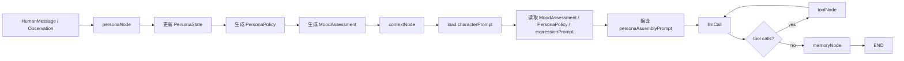
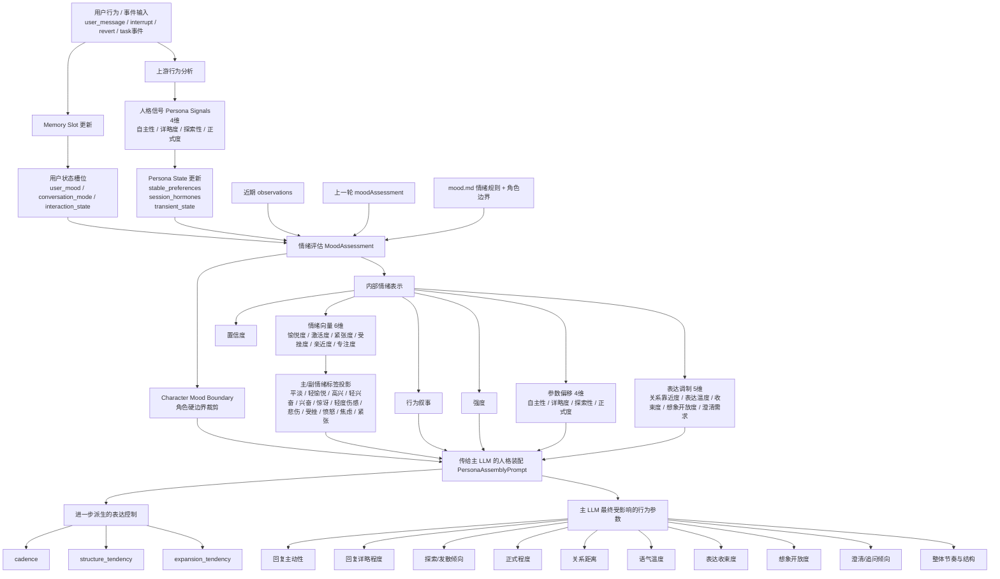

# 人格状态与装配链说明（当前已落地实现）

## 文档定位

这份文档只描述 `worldEdit-agent` 当前已经落地的主人格链。

它回答的是两件事：

- 用户输入进入主 agent 后，人格系统实际上经过了哪些步骤
- `character / mood / expression` 目前在代码里是如何被编译并注入主模型的

这不是理想态草图，而是当前代码真相。

---

## 当前主链

当前主 graph 仍然是：

`START -> personaNode -> contextNode -> llmCall -> (toolNode 循环 | memoryNode) -> END`

其中与人格直接相关的关键段只有前三段：

1. `personaNode`
   负责更新人格状态，并产出 `PersonaPolicy + MoodAssessment`
2. `contextNode`
   负责把人格相关信息编译成统一的 `personaAssemblyPrompt`
3. `llmCall`
   消费这份人格装配结果，并结合 `personaPolicy.sampling` 生成回复

`memoryNode` 不参与本轮回复风格形成，只负责在回复结束后回写记忆。

---

## 当前已落地的人格装配链

当前 `personaAssemblyPrompt` 已经不是三段松散 prompt 的简单拼接，而是三段显式编译结构：

1. `CharacterAnchor`
2. `MoodAssessment`
3. `ExpressionProjection`

---

## 一、personaNode 当前真实职责

`personaNode` 当前做的不是“角色扮演”，而是运行时人格调节。

它会：

- 读取 `InteractionObservation`
- 读取当前 `PersonaState`
- 读取 `memorySlots`
- 根据 observation 更新：
  - `stable_preferences`
  - `session_hormones`
  - `transient_state`
- 汇总为新的 `metrics`
- 生成 `current_behavioral_narrative`
- 编译结构化 `MoodAssessment`
- 最终产出 `PersonaPolicy`

当前 `PersonaPolicy` 仍然只包含四个出口：

1. `sampling`
2. `tool`
3. `style`
4. `memory`

这意味着：

- 采样参数由人格影响
- 工具调用边界由人格影响
- 风格说明由人格影响
- 记忆窗口参数由人格影响

其中 `MoodAssessment` 当前已经是实际 runtime 中间结果，会进入 graph state。

但它还不是持久化实体。

---

## 二、slot 与 MoodAssessment 的语义边界

这层边界在当前项目里必须明确分清：

- `slot`
  反映**用户侧近期状态**
- `MoodAssessment`
  反映**AI 侧阶段状态**

也就是说：

- `slot` 不是 AI 的情绪
- `slot.user_mood` 不是 `MoodAssessment`
- `slot` 只是 `personaNode` 的输入证据之一
- `MoodAssessment` 才是系统对 AI 当前内部状态的编译结果

当前 `slot` 主要包含两类信息：

1. `conversation_state`
   - 当前对话模式
   - 当前互动状态
2. `user_mood`
   - 用户近期情绪标签
   - 用户情绪正负性与置信度

这些信息当前仍然保留，并继续承担三类职责：

- 作为 `personaNode` 的输入
- 作为 memory 层当前状态的一部分
- 作为 UI / 观察状态展示的一部分

但在主模型侧，当前已经开始做语义收口：

- `slot.user_mood` 不再直接对主模型发声
- 用户侧情绪不再作为一条独立 prompt 提示直接进入主模型
- 主模型更应通过 `MoodAssessment + ExpressionProjection` 感知 AI 已经形成后的状态结果

因此当前最准确的关系是：

`slot(user_state) -> personaNode -> MoodAssessment(ai_state) -> ExpressionProjection -> 主模型`

---

## 三、当前统一人格装配 prompt

当前在 `contextNode` 中，会统一读取：

- `characterPrompt`
- `MoodAssessment`
- `PersonaPolicy`
- `expressionPrompt`

然后编译为一份单独的 `personaAssemblyPrompt`，再作为 `SystemMessage` 注入主模型。

这一步的意义是：

- 不再把人格拆成三段互相独立的系统提示
- 把长期人格、当前调制、最终表达收拢为同一份运行时人格视图
- 让主模型接收到的是“编译后的人格结果”，而不是一堆分散文档

与此同时，memory slot 仍然会保留：

- `conversation_mode`
- `interaction_state`

这两项更偏向对话场景与互动动作提示；

但 `user_mood` 当前已不再作为独立 slot prompt 直接提供给主模型。

---

## 四、三段显式编译结构

### 1. CharacterAnchor

`CharacterAnchor` 是当前装配结果中的最高优先级稳定锚点。

它当前来自：

- 已保存的 `characterPrompt` 文本

它当前在 prompt 中被当作：

- 长期身份定义
- 与用户关系定义
- 长期价值倾向定义
- 默认语气气质定义

当前真实状态：

- 它已经被作为单独段落显式编译进 prompt
- 但它还不是数据库里的结构化对象
- 它目前仍然以“角色文档文本”作为源，再在装配时被包装成 `CharacterAnchor`

也就是说，当前已经实现的是：

`CharacterAnchor 作为运行时编译视图存在`

而不是：

`CharacterAnchor 作为独立状态实体存在`

### 2. MoodAssessment

`MoodAssessment` 当前已经是结构化 runtime 中间结果。

它当前由以下来源共同编译：

- `PersonaState.current_behavioral_narrative`
- `PersonaState.metrics`
- `memorySlots.conversation_state`
- `memorySlots.user_mood`
- `PersonaPolicy.signals`

它当前表达的是：

- AI 当前阶段情绪标签
- AI 当前强度、置信度、正负性、激活度、作用时域
- AI 当前对人格参数的偏移摘要
- AI 当前更靠近、收束、扩展还是确认的 modulation
- 当前对话模式、互动状态、用户近期状态对 AI 的影响结果

当前真实状态：

- 它已经在 `personaNode` 中被编译成结构化对象
- 它已经进入 `MessagesState`
- `contextNode` 与 `ExpressionProjection` 现在优先消费这份对象
- 当前对主模型的直接暴露已经做了第一轮简单裁剪
- 它在主模型侧不应再显得像“用户状态报告”
- 它仍然没有持久化到数据库 / `PersonaState`

因此当前最准确的说法是：

`MoodAssessment 已经成为独立运行时数据结构，但尚未成为持久化状态实体`

### 3. ExpressionProjection

`ExpressionProjection` 当前也是显式编译段，而不是单独 node。

它当前由以下来源编译：

- `expressionPrompt`
- `PersonaPolicy.style`
- `MoodAssessment`

它当前向主模型传递的是：

- 当前细节密度
- 当前 tone
- 当前在场感
- 当前关系距离
- 当前收束力
- 当前想象开放度
- 当前温度
- 当前语言节奏
- 当前结构倾向 / 展开倾向 / 追问倾向
- 最终输出契约

当前真实状态：

- 它已经在 prompt 中作为独立段存在
- 它已经承担“把人格变成可见表达”的职责
- 它现在优先依赖 `MoodAssessment.modulation`
- 但它还没有被拆成独立 `expressionNode`
- 它仍然在 `contextNode` 内完成编译
- `MoodProjection` 映射层尚未独立实现，当前仍采用“内部完整 MoodAssessment + 对主模型简单裁剪暴露”的过渡方案

---

## 五、当前三层的真实边界

### CharacterAnchor

回答：

`我是谁`

负责：

- 稳定身份
- 关系姿态
- 长期价值倾向
- 默认语气气质

### MoodAssessment

回答：

`我此刻内部如何收缩、靠近、展开、确认`

负责：

- 当前阶段行为调制
- 当前状态解释
- 风格偏移提示

### ExpressionProjection

回答：

`这些内部状态最终应如何呈现给用户`

负责：

- 最终可见表达方向
- 输出契约
- 组织方式
- 意识投影方式

---

## 六、当前代码与理想架构之间的差异

下面这些内容已经实现：

1. `personaNode` 负责人格状态更新与 `PersonaPolicy` 生成
2. `contextNode` 负责统一人格装配
3. 统一装配 prompt 已经显式拆成三段：
   - `CharacterAnchor`
   - `MoodAssessment`
   - `ExpressionProjection`

下面这些内容还没有实现为独立对象或独立节点：

1. `CharacterAnchor` 的结构化存储
2. `MoodProjection` 的独立映射层
3. `MoodAssessment` 的持久化与跨轮衰减独立管理
4. `ExpressionProjection` 的独立 node 化

所以当前系统最准确的描述不是：

`三层人格已经全部对象化`

而是：

`CharacterAnchor / ExpressionProjection 仍是编译层对象，MoodAssessment 已是 runtime 中间对象，而 PersonaState / PersonaPolicy 仍是核心持久化控制实体`

---

## 六、当前记忆在这条链里的位置

当前记忆系统仍然重要，但它在这条人格链里扮演的是“辅助人格编译”和“提供连续性”的角色。

当前 `contextNode` 注入顺序可以理解为：

1. 注入统一人格装配 prompt
2. 注入 task lifecycle 相关 system prompt
3. 注入 tool usage 相关 system prompt
4. 注入 memory anchors / long-term / slot / recent-stage
5. 注入短期窗口 history

这里的关键点是：

- 人格装配先进入
- 记忆负责补充背景和连续性
- 短期 history 负责自然接话

---

## 七、下一步最自然的演化方向

如果继续往下推进，最自然的顺序应该是：

1. 先继续收口主模型侧可见的人格通道
2. 再让 `CharacterAnchor` 从原始文档进一步压缩成真正可传递的结构化锚点
3. 然后引入独立的 `MoodProjection`
4. 最后再决定是否需要把 `ExpressionProjection` 从 `contextNode` 中拆成独立 node

在当前阶段，不新增 node 是合理的。

因为现在最重要的不是继续拆 graph，而是先让：

`人格三层的运行时边界清楚`

以及：

`主模型接收到的是编译后的人格结果，而不是分散人格文档`

这两件事已经落地。

